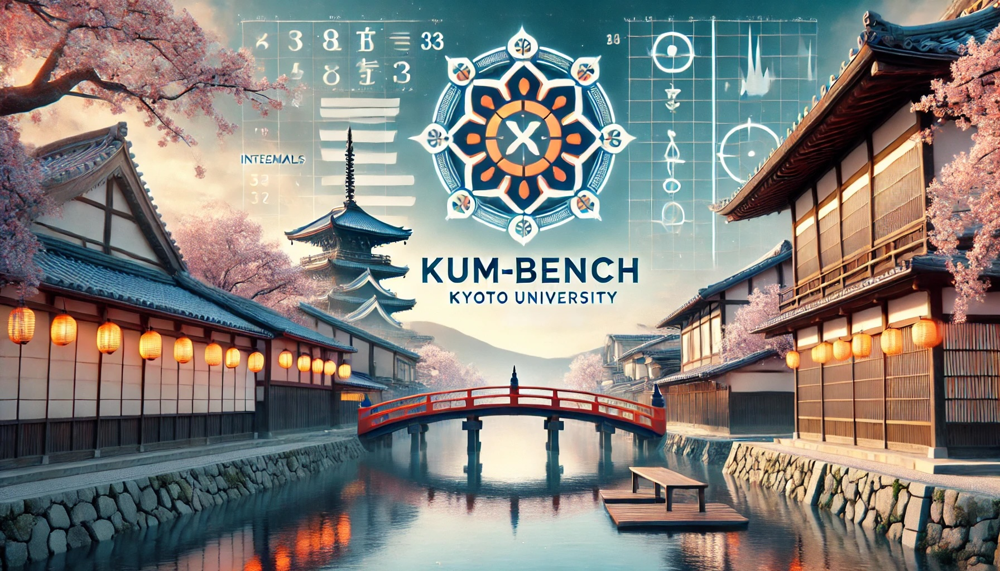
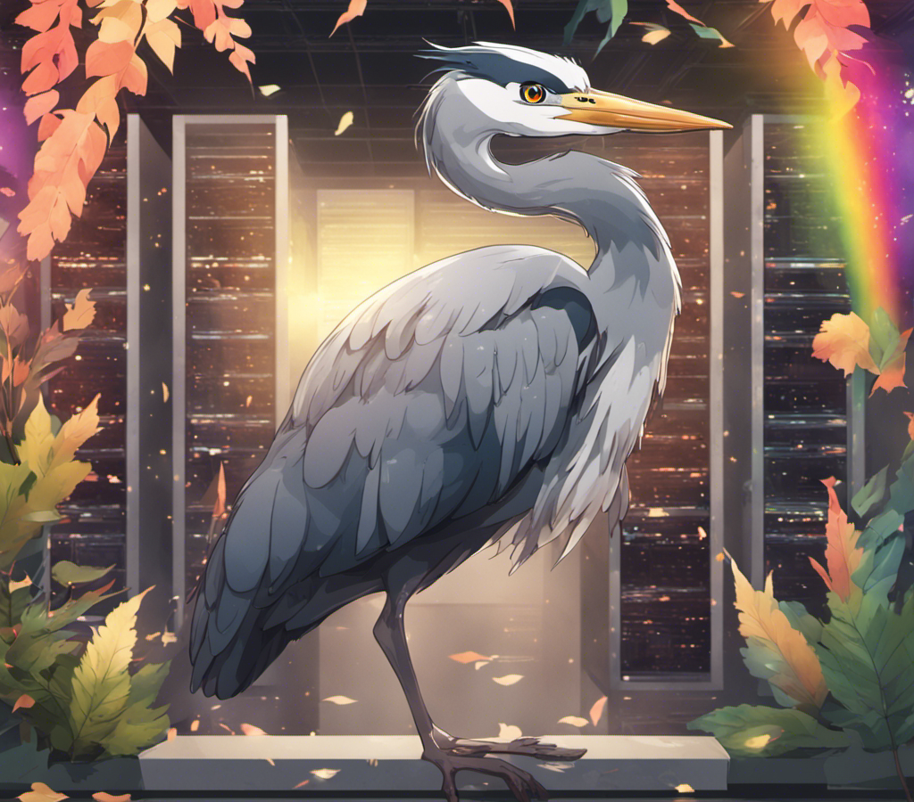
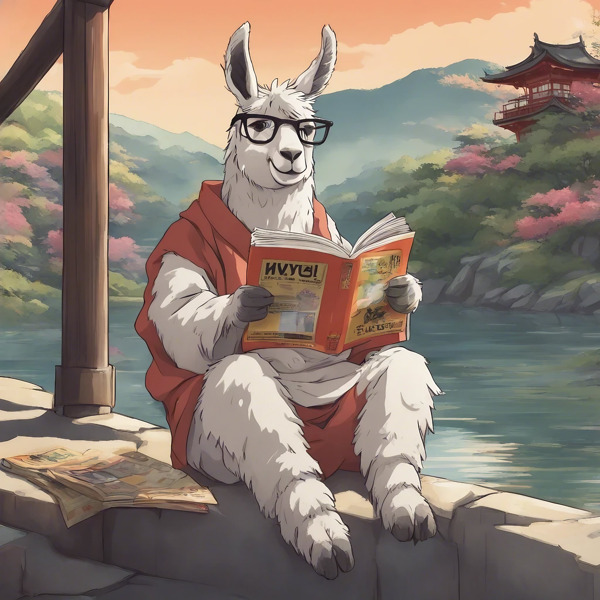

## Yuichi Inoue

Research Engineer at [Sakana AI](https://sakana.ai/). I work on **LLM reasoning, post-training, and inference-time scaling**.

[Website](https://ino-ichan.github.io/) · [Scholar](https://scholar.google.co.jp/citations?user=ymWagJwAAAAJ&hl=en) · [Hugging Face](https://huggingface.co/Inoichan) · [X](https://x.com/inoichan)

### Research

**AB-MCTS** · NeurIPS 2025 Spotlight\
Adaptive tree search for LLM reasoning. Co-first author; led experiments and co-developed the experimental code.\
[Paper](https://arxiv.org/abs/2503.04412) · [ARC-AGI-2 experiments](https://github.com/SakanaAI/ab-mcts-arc2)

**Fast-Math-R1** · ICML 2025 AI for Math Workshop\
Efficient mathematical reasoning through SFT and reinforcement learning. Corresponding author.\
[Paper](https://arxiv.org/abs/2507.08267) · [Training code](https://github.com/analokmaus/kaggle-aimo2-fast-math-r1) · [Models](https://huggingface.co/RabotniKuma/Fast-OpenMath-Nemotron-14B)

**FishMath** · AIMO3\
Post-training for mathematical problem solving, with released models and training data.\
[Model](https://huggingface.co/SakanaAI/gpt-oss-120b-sft-aimo3-fishmath) · [Dataset](https://huggingface.co/datasets/SakanaAI/FishMath-SFT-Data) · [Writeup](https://www.kaggle.com/competitions/ai-mathematical-olympiad-progress-prize-3/writeups/pushing-the-limits-post-training-high-capability)

### Models & benchmarks

- **KUM-Bench** — Japanese mathematical reasoning benchmark based on Kyoto University entrance exams. [Code](https://github.com/Ino-Ichan/KUM-Bench) · [Dataset](https://huggingface.co/datasets/Inoichan/KUM-Bench)
- **Heron & Heron-Bench** — Earlier work on vision-language training and Japanese evaluation; Heron-Bench first author. [Code](https://github.com/turingmotors/heron) · [Paper](https://arxiv.org/abs/2404.07824)
- **EvoVLM-JP & JA-Multi-Image-VQA** — Earlier Japanese vision-language models and multi-image evaluation. [Models](https://huggingface.co/SakanaAI/Llama-3-EvoVLM-JP-v2) · [Dataset](https://huggingface.co/datasets/SakanaAI/JA-Multi-Image-VQA) · [Project](https://sakana.ai/evovlm-jp/)

### Kaggle & community

[Kaggle Competitions Grandmaster](https://www.kaggle.com/inoueu1) and main organizer of [Kanto Kaggler Meetup](https://kanto-kaggler.connpass.com/), one of Japan's largest Kaggle communities.

[Competition writeups](https://ino-ichan.github.io/blog/#kaggle-writeups) · [Talk recordings](https://www.youtube.com/@inoichan)
